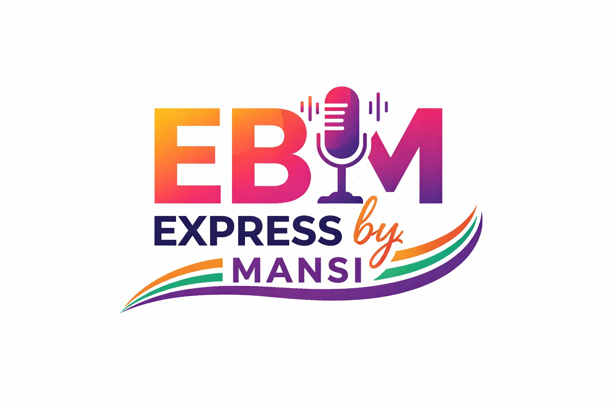

<p align="center">
  
</p>


<h1 align="center">Express By Mansi</h1>

<p align="center">
  🎙️ Podcast • 🚀 Tech • 🌐 Web3 • 🤖 AI • ✨ Digital Expression
</p>

---

## 🌟 About

**Express By Mansi** is the official website of *EBM* — a podcast and creator platform where technology meets expression.  
The platform explores **Web3, Artificial Intelligence, Blockchain, digital trends**, and the **creator journey** through podcasts, conversations, and visual storytelling.

This project is built as a modern, responsive web experience using **React** and **Vite**.

---

## 🔥 Features

- 🎧 Podcast & episode showcase  
- 🌐 Tech topics: Web3, AI, Blockchain  
- 📱 Fully responsive design  
- ⚡ Fast performance with Vite  
- 🎨 Clean UI with modern animations  
- 🔗 Social media integration  

---

## 🛠️ Tech Stack

- **React**
- **Vite**
- **JavaScript (ES6+)**
- **CSS / Tailwind-style utility classes**
- **Lucide Icons**

---

## 🚀 Live Demo

> 🔗 *Coming soon (Deployed via Vercel)*

---

## 📂 Project Structure

```bash
express-by-mansi/
├── public/
│   └── ebm-logo.jpeg
├── src/
│   ├── App.jsx
│   ├── main.jsx
│   └── index.css
├── index.html
├── package.json
└── vite.config.js
